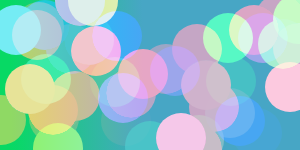
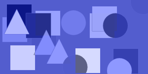
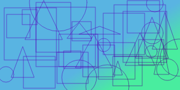
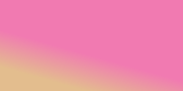
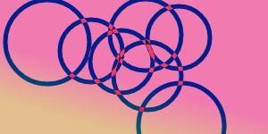
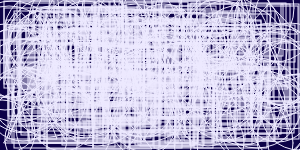

Looking for some weird,random, and maybe good looking background? why dont you roll your luck on this web app!
https://kin-zhung.github.io/RandomAbstractBGG/

Generates gradient backround, solid background, and common shapes such as rectangles,squares, triangles, and circles. Color and position is always randomed, but you can set certain options such as the composition of the image max width and height of shapes, border,fill, and rotation! Once you find something you like before trying your luck again save the current image and with auto load on it will always show the changes on the next change but retain the orginal image intill you save again, and simply download once you have found the right one!.

Here are some examples!

